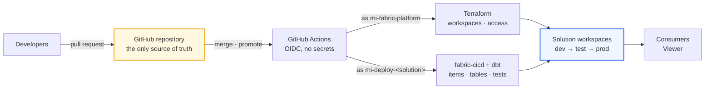

# Fabric DataOps Blueprint

In organisations that adopt modern software practices, the production environment is not a place users can directly edit.  
It is the result of running processes against source code. Change the source, run the processes, and you get a new production.
Most Fabric estates are not operated this way. Instead, changes are made to items in place.

This repository explores the adoption of Microsoft Fabric based on one key principle: **code is the source of truth**.
The beneficial implications that flow from this core foundation include:
- **History.** In the service, an overwritten report is gone. In Git, every version is kept, and restoring one is a redeploy.
- **Consistency.** Every environment is built from the same source.
- **Traceability.** The pull request records who changed what, the reasoning, and who approved it.
- **Reliability.** Changes are tested before reaching production.
- **Scalability.** Adding a team's solution is configuration, not a project. The fiftieth runs with the same pipelines, checks, and tests as the first.

This design is intended for large enterprises that want to manage a data estate at scale with confidence.

One caveat: code rebuilds definitions, not data.  Where a table holds history the upstream no
longer has, its state is irreplaceable. Such tables are systems of record and must be protected as such.

## Choosing a release process

Microsoft's guidance names [three ways to release changes to Fabric workspaces](https://learn.microsoft.com/fabric/fundamentals/understand-best-practices-fabric-cicd),
and this repository deliberately takes the most involved one.

**Deployment pipelines** — Fabric's native promotion tool. A [deployment pipeline](https://learn.microsoft.com/fabric/cicd/deployment-pipelines/intro-to-deployment-pipelines)
chains workspaces into stages and, on request, copies the items in one stage over the paired items in the
next. It needs no setup beyond the portal, shows a comparison of stages before you deploy, keeps a deployment history,
and can be driven by API. Microsoft positions it as the lowest-effort option that's a good fit for
[small-to-medium projects focused on semantic models and reports](https://learn.microsoft.com/fabric/fundamentals/understand-best-practices-fabric-cicd#how-can-you-automate-fabric-ci-cd).
For a team whose estate is a handful of Power BI items it may be all you need. It falls short of the standard set
out above once an estate grows: the source of truth is the `dev` workspace rather than the repository, nothing is
tested in transit, whoever promotes to production can also edit it, and item coverage is partial — see Microsoft's own
[considerations and limitations](https://learn.microsoft.com/fabric/cicd/deployment-pipelines/understand-the-deployment-process#considerations-and-limitations).

**Git synchronization** — a branch per environment, each workspace updated from its own branch. Everything is
visible in Git, but environments *become* branches: a change travels between them as cherry-picks, drift between
environments returns, and no single tested artefact moves through the stages.

**API-driven** — build once from `main`, deploy the same immutable bundle to every environment with
[fabric-cicd](https://github.com/microsoft/fabric-cicd). The source of truth is the repository, changes are tested
in transit, and environments are byte-identical by construction. It is the highest-effort option; paying that cost
well is what the rest of this repository demonstrates.

## The unit of work: a solution

The repository's unit of work is what it calls a **solution** - one team's product with a [`dev` → `test` → `prod` set of
workspaces](docs/path-to-production.md#the-three-workspaces) and one folder under `solutions/`. The platform hosts as many solutions as you need on shared capacity, and
solutions exchange data only through OneLake shortcuts.

| Layer | Per solution | Shared | Owned by |
|---|---|---|---|
| Control plane | Three workspaces (`ws-<solution>-dev/test/prod`), roles, a workspace identity, connections | Capacities, the Terraform module that creates a solution, the platform identity | Terraform, as `mi-fabric-platform` |
| Data plane | Notebooks, semantic models and reports, and the dbt project that builds Silver and Gold — everything under `solutions/<name>/` | Nothing; a solution never writes into another's workspace | fabric-cicd and dbt, as `mi-deploy-<solution>` |
| Stores — both planes at once | The Lakehouse (Bronze) and Warehouse (Silver and Gold). Their *existence* is control plane; the *schema inside them* is data plane | — | fabric-cicd creates the empty item; dbt owns everything in the warehouse |
| Delivery | GitHub environments `<solution>-dev/test/prod` with the team's own reviewers; one build per merge; the same bundle promoted through every environment | The workflows, parameterised by solution; the artefact store | GitHub Actions with OIDC — no stored secrets |
| People | The team holds Viewer on its shared workspaces and authors locally or in a feature workspace of their own; changes land only through a pull request | The break-glass group (PIM) and the platform approvers | Entra groups |

That third row is the one worth pausing on, because it is where most Fabric designs get
muddled. A lakehouse or a warehouse is a *container*: creating it is an infrastructure act,
but what lives inside it is data. Splitting the two is what lets **one mechanism own each
store** — fabric-cicd brings the warehouse into being from a folder holding nothing but a
`.platform` file, and from that moment dbt owns every table in it. Terraform is deliberately
not in that path: it creates workspaces and grants, not items.

The cost is visible and worth knowing before you meet it. Because the warehouse folder
carries no schema, Fabric's Git integration rejects it — and because Fabric would want to own
that schema itself (as a DacFx database project) if it did, adopting warehouse Git
integration would put a second owner on a store dbt already owns.

Adding a solution is one folder copied from `solutions/_template` — everything else is derived from it.

## How it fits together



Developers commit and merge changes to the repository, GitHub Actions applies those changes using two identities with two jobs:
- `mi-fabric-platform` creates workspaces and grants access,
- `mi-deploy-<solution>` changes what is inside them.

No human writes to a shared workspace, and a solution's identity can write only to that solution's
workspaces — so a compromised deployment reaches one team's data and no part of the platform. The one
crossing: scheduled operations run as the platform identity, because only it can resume a paused
capacity. It moves *data* on a published definition; it never publishes.

## Different components, the same phases

A solution mixes different types of item — reports, semantic models, notebooks, transformation code, sometimes a
database — and each type has its own idea of what "build" and "test" mean. Rather than flattening those differences,
the design gives every component the same four phases and lets each type implement them its own way:

- **Validate** — checks that run in the pull request with no cloud access: linting, format locks, report and model rules.
- **Build** — produce the deployable artefact: a bundle of item definitions, a parsed dbt project.
- **Deploy** — apply that artefact to one environment: fabric-cicd publish, `dbt build`.
- **Verify** — prove it worked: item counts, dbt's own tests, smoke queries.

The repository's scope is deliberately the set of items fabric-cicd can deploy, plus dbt for transformation — which
is very nearly the set of things Fabric allows to be deployed as code at all.
A solution's components are declared by its folders — the directory name is the component type — and the workflows
run the phases in dependency order, knowing nothing about the tools. Another component of an existing type is a folder.
A new *type* — Airflow, a Fabric App — is one implementation of the four phases.

## Quickstart

From fork to a running platform in eight steps — the first five are a human with a laptop, once; everything after is a pull request.
The walkthrough lives in [docs/quickstart.md](docs/quickstart.md).

## Where things live

```
platform/     Terraform — capacities and the solution module: workspaces, roles, identities, connections
solutions/    one folder per solution: Fabric item definitions, dbt project, deploy config
  _template/  what a new solution starts from
  sales/      the worked example
  finance/    a second solution, reading sales' gold tables through a OneLake shortcut contract
.github/      CI — one workflow per concern: validate pull requests, build and deploy, platform Terraform
docs/         quickstart · the path to production · the tooling and the choices · authoring in the portal
samples/      synthetic retail data that the whole repository teaches from
```

## Try it without a tenant

Validate and build are cloud-free by construction — that is what makes a pull request cheap. With
`uv` installed you can run the whole offline half in a minute:

```bash
uv sync                                        # pinned toolchain
uv run pytest -q                               # the guards' failing fixtures
uv run python deploy/guards.py                 # the repository guards
uv run python deploy/build.py --solution sales --sha demo
```

The last command writes `dist/sales-demo.tar.gz` and a `release-manifest.json` whose
`content_digest` is derived from the source alone — build it twice, get the same digest. That
reproducibility is what lets promotion move bytes instead of rebuilding them.

## What it costs

An F2 capacity bills about US$0.36/hour while running and nothing while paused. This repository
pauses nightly and resumes for the scheduled run, which lands it near US$20–25/month; the Terraform
apply includes a budget alert at US$25 as a backstop. Deploys and dbt need the capacity running —
the `capacity` workflow is the resume button.

Reading order: evaluating the design — this page, then [the path to production](docs/path-to-production.md)
for how a change travels and [the tooling and choices](docs/tooling.md) for what else was possible and
what each option costs; adopting it — [the quickstart](docs/quickstart.md); writing a change —
[authoring locally](docs/local-authoring.md) or [in the portal](docs/portal-authoring.md);
maintaining it — the
maintainer notes in [CLAUDE.md](CLAUDE.md).

MIT-licensed. One maintainer, best effort.
