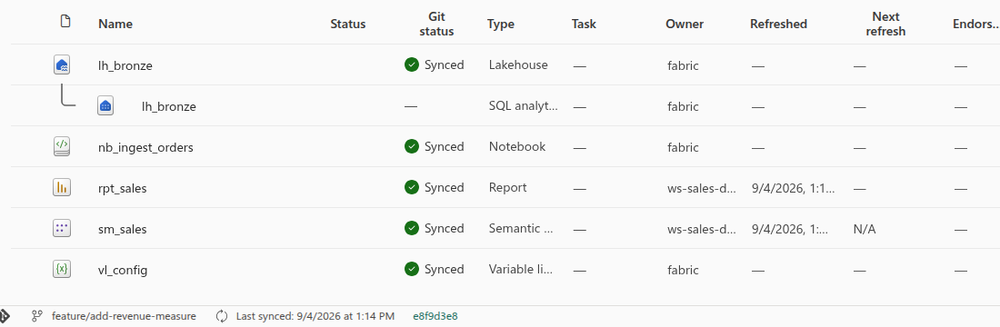
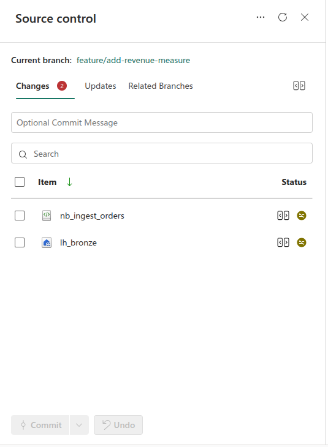

# Authoring in the portal, on your own branch

Some changes are easier to make in Fabric than in a text editor — a report, a semantic
model, a notebook you want to run interactively. This is how to do that without anyone
editing a shared workspace.

The rule that makes it safe: **writes go to your workspace, reads come from the shared
one.** Nobody can write to `ws-<solution>-dev` — the team holds Viewer there — so your
workspace is where drafting happens, and a pull request is how it becomes real.

## What Microsoft calls this, and how this repository differs

Microsoft's [branched workspace](https://learn.microsoft.com/fabric/cicd/git-integration/branched-workspace)
is a workspace **linked to a source workspace**. You create one with **Branch out to
another workspace** from a Git-connected workspace's Source control pane: Fabric cuts a
new branch from the source workspace's branch, creates the workspace, connects it, and
syncs it — one command. The link it establishes is what gives you the parent in the
workspace tree, breadcrumbs back to the source, and the **Related Branches** tab.

**No workspace here is connected to Git.** `ws-<solution>-dev` is a deployment target
like test and prod, which is a [deliberate choice with a cost](tooling.md#what-this-repository-chose),
and this is the cost: there is no source workspace to branch out *from*, so the command
does not appear. What follows is the manual equivalent — an isolated workspace on your own
branch that round-trips through Git exactly the same way.

What you give up is the relationship, not the isolation: no parent in the workspace tree,
no breadcrumbs, no Related Branches tab. If you want it later, Microsoft has a preview
[Create Workspace Relation API](https://learn.microsoft.com/rest/api/fabric/core/git/create-workspace-relation)
intended for exactly this case — an automation that prepared the branch, the workspace and
the Git connection itself.

## Before you start

| You need | Why |
|---|---|
| Membership of `grp-fabric-workspace-creators` | It carries workspace-creation rights, and the *Users can sync workspace items with GitHub repositories* tenant setting is scoped to it. Without it, connecting fails with `FeatureNotAvailable` and names no setting |
| A [fine-grained GitHub token](https://github.com/settings/personal-access-tokens/new) with **Contents: read and write** on this repository | Fabric's GitHub connector authenticates with a token, not with your Microsoft sign-in. This is the one secret the design sanctions, it is yours alone, and a short expiry is fine |
| Capacity headroom | A workspace needs a capacity, and this demo's is paused most of the time — resume it first |

## 1. Create the branch first

Fabric connects to a branch that already exists, so push it before you go near the portal.

```bash
git switch -c feature/add-revenue-measure
git push -u origin feature/add-revenue-measure
```

## 2. Create the workspace

In Fabric, **Workspaces → New workspace**. Name it `ws-<solution>-dev-<you>` so it is
obvious whose draft it is, and assign it to the same capacity as the solution.

Not *My workspace* — Fabric's
[Git integration limitations](https://learn.microsoft.com/fabric/cicd/git-integration/git-integration-process#considerations-and-limitations)
state plainly that it can't connect to a Git provider, so none of what follows works
there. It would be a poor fit regardless: you get one, so two branches at once is
impossible; nobody else can see your draft; and the lifecycle below ends by deleting the
workspace, which you cannot do to *My workspace*.

## 3. Connect it to your branch

**Workspace settings → Git integration**. Choose GitHub, add your account with the token,
then point it at the repository, your branch, and the solution's folder.


Fabric then offers to fill the workspace from the branch — accept it. Only
[Git-supported item types](https://learn.microsoft.com/fabric/cicd/git-integration/intro-to-git-integration#supported-items)
arrive; anything else the solution deploys simply will not be there. Every item that did
sync shows **Synced**, with the branch and last-synced commit along the bottom.



## 4. Work

Edit items in the portal as you normally would. Anything you touch flips to
**Uncommitted** in the Git status column.

## 5. Commit to your branch

Open **Source control**, review what changed, write a message, and commit. This pushes
straight to your feature branch.



Expect noise alongside your real change. Fabric writes files without a trailing newline
and rewrites line endings, so items you never opened can appear as modified — the
screenshot above shows exactly that: `nb_ingest_orders` is a genuine edit, `lh_bronze` is
whitespace. Read the list before you commit and uncheck what you did not mean to touch.

To move to a different branch, use **Switch branch** in the same pane rather than
disconnecting. Commit first: you cannot switch with uncommitted changes, every item is
overridden by the new branch's version, and an item that exists only in the old branch is
deleted.

## 6. Open a pull request

From here it is the ordinary path. The pull request runs the same gates as any other —
linting, tests, the repository guards, an offline dbt parse — and on merge the build
publishes to `ws-<solution>-dev` as the deploy identity. Your workspace played no part in
that: the repository did.

## Reuse it, rather than one per feature

Creating a workspace per feature proliferates fast: three developers with two branches
each is six workspaces, and every one needs creating, connecting and syncing. Fabric
supports the alternative — keep the workspace and move it between branches with **Switch
branch** in the Source control pane.

One constraint decides the shape: a switch target *must contain the same directory* the
workspace is connected to. A workspace is therefore bound to one solution's folder, which
makes the natural unit **one workspace per developer per solution** — `ws-sales-dev-mark`
lives as long as you work on sales, and moves from branch to branch as you do.

| | One per feature | One per developer, per solution |
|---|---|---|
| How many exist | One per open branch, across the team | One per person per solution they touch |
| Starting work | Create, connect, sync each time | Switch branch |
| Isolation | Complete — nothing survives from the last feature | Switching overrides every item, and deletes items absent from the new branch. Abandoned drafts can linger |
| Before you move on | Delete the workspace | Commit first: you cannot switch with uncommitted changes |
| Suits | An occasional change, or a shared demo tenant | Anyone working on features regularly |

Switching is restricted to workspace admins unless someone enables **Allow users with at
least Contributor role to change Git branch** on that workspace. You are the admin of your
own, so this only matters if you share one.

Recycling is the better default for a real team; the per-feature flow above is what to do
the first time, and remains right when a draft is genuinely throwaway.

## 7. Dispose of it

**Delete the workspace when you no longer need it** — when the pull request merges if it
was per-feature, or when you stop working on that solution if you recycle it. It is a
draft space, not an environment: nothing in it is a source of truth, and anything worth
keeping is already in the branch. Commit before you delete — items never committed are
simply gone. A deleted workspace is restorable for 30 days if you go too early.

An idle workspace does not burn capacity units on its own, so this is about clutter and
governance rather than cost: every one is another place someone can mistake a draft for
something real, and another entry an admin has to reason about.

Delete the branch too; GitHub does that for you on merge.

## What does not sync today

`solutions/<name>/fabric` contains `wh_analytics.Warehouse`, which holds only a
`.platform` file because a warehouse has no exportable definition. fabric-cicd deploys it
happily; Git integration rejects **the whole folder** with `MissingItemDefinitionFiles`.
Until the warehouse is created by Terraform rather than shipped in the bundle, connect
your workspace to a branch where that folder is absent.

The measured detail behind this, and what else a round trip does to item definitions, is
in [the path to production](path-to-production.md#what-a-branched-workspace-does-to-this-repository).
