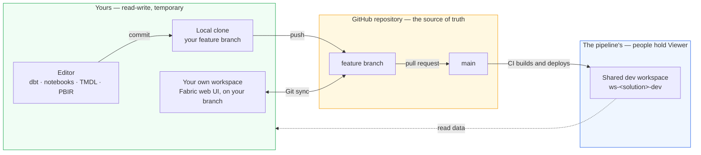

# Authoring locally, in a copy of the repository

This is the default path and the one that needs nothing provisioned: clone the repository,
edit files, open a pull request. Microsoft's guidance says the same —
[developers using a client tool](https://learn.microsoft.com/fabric/cicd/best-practices-cicd)
*"don't necessarily need a workspace… A workspace is needed only as a testing environment."*

For the work that genuinely wants a running workspace, see
[authoring in the portal](portal-authoring.md).

## Everything here is a text file

TMDL for the semantic model, PBIR for the report, Python for the notebook, SQL for dbt.
Edit them with whatever fits — VS Code, an ordinary editor, or Power BI Desktop if you have
Windows and accept that this repository has never exercised the Desktop round trip — and the
change reaches the repository as a commit and a push. Nothing needs to be provisioned for
you, and the whole validation half runs offline: linting, tests, the guards, a dbt parse.

Authoring against real data does not require a workspace of your own either: the team holds
Viewer on `ws-<solution>-dev`, so a client tool can point at that warehouse's SQL endpoint
and build a model or report against data the pipeline maintains.

### What you cannot run locally

Editing is local. Execution is not. Every gate that runs on a pull request here is
deliberately cloud-free — ruff, pytest, the guards and a `dbt parse` need no capacity, no
credentials and no workspace, which is why a fork's pull request is safe to run and
finishes in seconds. The cost is exact: **nothing is executed against Fabric until after
the merge**, when the build deploys to `ws-<solution>-dev`. SQL that parses but does not
run reaches `main` first, and dev is what catches it.

| What needs Fabric | Why | What to do instead |
|---|---|---|
| `dbt build`, `dbt test` | dbt-fabric connects to a live warehouse over TDS. Viewer on the shared dev workspace can read that warehouse but not write to it, and does not grant OneLake read at all, so neither half of the model can run there | Point `DBT_FABRIC_SERVER` and `DBT_FABRIC_DATABASE` at **any empty warehouse you can write to** — dbt builds every object it needs. `deploy/build.py` and `deploy/deploy.py` will set one up in a workspace of your own using the same machinery CI uses |
| `nb_ingest_orders` | `notebookutils` is [only available in the remote runtime](https://learn.microsoft.com/fabric/data-engineering/fabric-runtime-in-vscode), and the paths it reads are OneLake | Usually nothing. dbt reads the seeded CSVs from `Files/` with `OPENROWSET`, not this notebook's Delta tables, so dbt work never depends on running it. When you do need it, the [Fabric Data Engineering VS Code extension](https://learn.microsoft.com/fabric/data-engineering/setup-vs-code-extension) edits and debugs locally while executing on remote Spark |
| Seeing a report render | Power BI Desktop is Windows-only | Edit the PBIR files directly — that is the committed format — and see the render in dev after the merge. There is no Linux-native alternative, and this repository has never tested the Desktop round trip |
| A semantic model against real data | Direct Lake binds to a live SQL endpoint | Desktop can point at dev's SQL endpoint on the Viewer grant while you author; `parameter.yml` rewrites the binding at deploy time |
| `terraform plan` over Fabric resources | The provider refuses to plan against a paused capacity | Resume the capacity first, or leave it — platform changes are applied by CI behind a gate anyway |

The pattern in that table is worth naming, because it is a property of the platform
rather than of this repository: **a Fabric item is a definition, not a program.** Any of
them can be edited anywhere, and none of them can be executed anywhere but a workspace on
a capacity. The alternatives above are all the same trick — keep the editor local and send
the execution somewhere that has compute.

### Which items are worth authoring where

The previous table is about compute. This one is about where a change should *start*, which
is decided by two things: what happens to an item when the portal writes it back and whether
a tool outside Fabric can open it at all.

Microsoft's rule is the one to begin from — *"if the items you're developing are available in
other tools, you can work on those items directly in the client tool… Items that are only
available in Fabric need to be developed in Fabric"* — and their guidance names exactly two
ways to work in isolation:
[a feature workspace, or client tools](https://learn.microsoft.com/fabric/cicd/git-integration/manage-branches).
It is explicit that the second usually needs no workspace: *"Developers using a client tool…
don't necessarily need a workspace… A workspace is needed only as a testing environment."*
That is this repository's default, and it is worth knowing it is theirs too.

Where this estate departs from their advice is narrow and has one cause. Microsoft names
[Power BI Desktop for semantic models and reports](https://learn.microsoft.com/fabric/cicd/best-practices-cicd)
and VS Code for notebooks. Desktop is Windows-only, so on Linux the report falls back to the
portal and the semantic model falls back to editing TMDL as text.

| Item | Author it | Why |
|---|---|---|
| dbt models | **Locally** | Not a Fabric item. There is no portal representation to edit |
| Warehouse | **Locally**, as dbt models | dbt owns every table in it. Fabric offers two serialisers and they disagree: the definition API refuses it (`getDefinition` answers `OperationNotSupportedForItemType`, measured) while [Git integration serialises it](https://learn.microsoft.com/fabric/data-warehouse/git-integration) as a DacFx database project of `.sql` files (preview). This repository uses neither — the folder holds only `.platform`, so fabric-cicd creates an empty warehouse and dbt fills it. That empty folder is what makes Git integration reject the *whole* directory with `MissingItemDefinitionFiles` |
| `.schedules` | **Locally** | Fabric rewrites the line endings, so a portal commit carries whitespace noise whether or not you touched it. It also cannot hold `parameter.yml`'s placeholder in a feature workspace: Fabric validates the schema and a string where a boolean belongs fails with `InvalidArtifactJobSchedulerException` |
| Report | **Desktop** if you have Windows, else the **portal** for layout | Microsoft's first choice is Power BI Desktop. Without Windows the portal is the only way to see a render, and a portal edit commits back as exactly that edit. Either way, in a feature workspace the visuals cannot bind to data (below), so anything data-driven waits for dev |
| Notebook | **Portal**, when you need to run it | The definition comes back unchanged, and interactive Spark is the one thing no local editor provides |
| Semantic model | **Locally**, as TMDL | Microsoft's first choice is Desktop; without Windows, TMDL in an editor. The portal is not an option regardless — the model cannot load in a feature workspace at all (below), and the export-path trap below applies |
| Variable library | Either | The definition comes back unchanged, and it is a small JSON file, so the editor is usually quicker |
| Lakehouse | Neither | Nothing to author: the definition is a shell and the content is data. A round trip adds an `alm.settings.json` |

**The semantic model is the row to be careful with.** `getDefinition` splits the model's
expression out of `model.tmdl` into a separate `expressions.tmdl` with the authoring
workspace's SQL endpoint baked into it, which silently defeats the `parameter.yml` rewrite
that is supposed to rebind it per environment — green everywhere, pointed at dev forever.
A guard fails the pull request when that happens. Git integration's serialiser does *not*
split the file, so a feature-workspace commit behaves better than an export does. Two
first-party serialisers disagreeing about the same item is reason enough to keep TMDL edits
in an editor, where what you wrote is what gets committed.

**How much of this is measured.** All of it, now. A report was edited in the portal of a
feature workspace and committed back: the diff is exactly the edit — a new page directory
and an updated `pages.json` — and the semantic model was not touched at all, confirming
through a real commit what was previously only inferred from the two serialisers differing.
What Fabric adds on top is uniform and harmless: every file it writes loses its trailing
newline, compact JSON comes back pretty-printed, and `.schedules` line endings are rewritten
(byte-different, identical when parsed). With no edit at all, only `lh_bronze` and
`nb_ingest_orders` report as Modified — the report, semantic model and variable library stay
clean.

One alternative deliberately not taken: running the dbt models against DuckDB or a local
SQL Server for a fast offline loop. The staging models reach OneLake through `OPENROWSET`,
so they would have to be rewritten to a dialect both engines share — trading a gate that
proves the models run in Fabric for a faster one that proves they run somewhere else.

Reads and writes split by construction:

- **Writes go to your feature workspace** — it is yours, and the shared workspaces
  refuse them anyway: team members hold Viewer there.
- **Reads come from the shared dev workspace** — the real, pipeline-maintained data,
  one Viewer grant away.
- **Need dev's data inside your isolated runs?** OneLake shortcuts from your feature
  lakehouse into dev's tables — real input, nothing copied.
