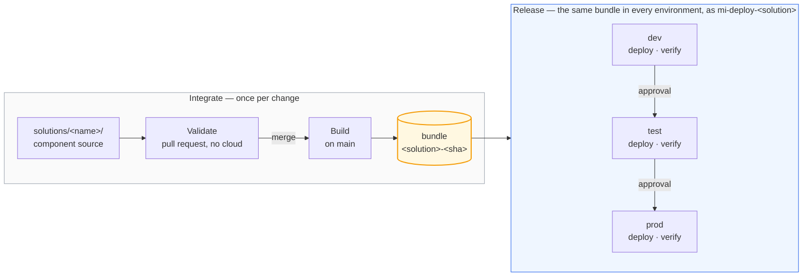

# The path to production

Every change takes the same path: authored on a feature branch, reviewed in a pull
request, merged after approval, built once, and deployed by machinery. This document
shows that path in two views — how work reaches the repository (Microsoft's
*development process*), and how the repository reaches a workspace (its *release
process*).

## Branching

The repository is trunk-based: one long-lived branch, `main`, and short-lived feature
branches — one per change, each optionally backed by a workspace of your own —
kept for the branch, or carried between branches as you go. Environments are not branches: dev, test and prod
differences resolve from values *inside* the bundle, and promotion moves the same
built bundle behind approval gates, recorded as GitHub Deployments. Branches are for
work in progress; environments are for released bundles. A hotfix takes the same
path, just faster.

## The three workspaces

Each solution has three. **dev proves the bundle, test proves the promotion, prod serves
the users.**

**dev** takes every merge, unattended, minutes after it lands: a real publish, a real
`dbt build`, real tests. Promotion refuses any bundle whose dev deploy was not green, so
dev is both the first environment and the gate. Nobody authors here — unlike the `dev` of
a deployment pipeline, it holds what the last merge produced and nothing else.

**test** takes the same bytes, into a workspace that did not build them. That is the only
way to find out whether the values that differ per environment actually rebind — the
semantic model's endpoint, the shortcut into another solution's gold, the value set, the
connection string. An ID that is hard-coded but right in dev is wrong here, and fails
here. It is also the first gate a human stands at.

**prod** is the only workspace with a live schedule, and the only one the nightly run
touches. That run operates the commit prod was promoted at, not `main`, so merging cannot
reach production behind the approvals. Rollback is promote pointed at an older build.

| | dev | test | prod |
|---|---|---|---|
| Deployed by | every merge | promote | promote, after test |
| Approval | none | one reviewer | one reviewer |
| Ingestion schedule | off | off | on |
| Nightly run | no | no | yes |

The workspaces themselves are identical — one Terraform module builds all three with the
same capacity, roles and identity — so what a workspace *is* never varies; only what has
happened to the bundle inside it. Three simplifications come with that:

- One capacity for all three: separation is by permission, not compute.
- One viewers group for all three: the team sees test and prod alike.
- The same sample data everywhere: test proves the release, not the volume.

## Where a change starts

Every change ships the same way: as a commit. Two documents cover how one gets written —
[authoring locally](local-authoring.md), which is the default and needs nothing provisioned,
and [authoring in the portal](portal-authoring.md), for the work that wants a running
workspace. The rest of this page is what happens after the commit.

## How a component deploys

A solution is made of typed components — Fabric items, a dbt project, a Fabric SQL
database — and every type moves through the same four phases. The phases are the
contract; each type implements them its own way.

- **Validate** — checks that need no cloud access: lint, format locks, rules.
- **Build** — produce the deployable artefact, once.
- **Deploy** — apply that artefact to one environment; the identity can write to
  that solution's workspaces and nothing else.
- **Verify** — prove it worked before the bundle is allowed any further.

Promotion re-deploys the *same* bundle to the next environment; nothing is rebuilt
between environments. The scheduled production run follows the same rule: it reads the
Deployments ledger for the commit prod was promoted at and operates *that* tree, so a
merge to `main` cannot reach production by way of the nightly job.

Where solutions meet, the contract is checked in the pull request. A shortcut
into another solution's warehouse names its producer (`SALES_WORKSPACE_ID`) and
the table it reads, and a repository guard asserts that producer still builds
that table. Without it the failure is silent: dbt leaves a renamed model's old
table in place, so the consumer's shortcut keeps resolving and its data simply
stops changing.

Three honest limits of the bundle:

- **Deployment is not atomic.** Items publish, then dbt rebuilds the marts. A dbt failure
  in the middle leaves published definitions over marts that have not caught up; the
  remediation is to fix forward or promote the previous bundle, and the nightly run will
  not repair it on its own.
- **Bundles expire.** They are GitHub Actions artefacts, kept 90 days on a public
  repository, so "roll back to any earlier run" has a horizon. Past it, rebuild at that
  commit: the digest is derived from source alone, so the bundle reproduces byte for byte.
- **The bundle carries definitions, not data.** Sample seeding reads the checkout, and no
  data ever travels between environments.

## Why this shape, and not another

Every choice above — an API-driven release, a bundle, Terraform for access, dbt
outside Fabric — had alternatives, and each cost something. Those decisions, the
tools available, and where this repository departs from Microsoft's guidance are
set out in [the tooling and choices page](tooling.md).
