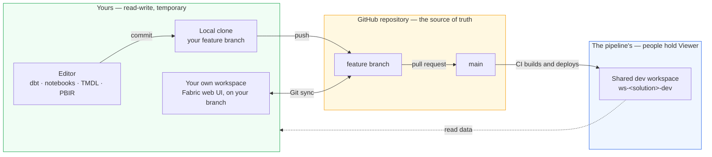
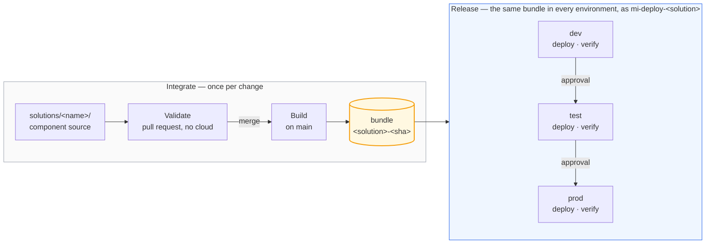

# The path to production

Every change takes the same path: authored on a feature branch, reviewed in a pull
request, merged after approval, built once, and deployed by machinery. This document
shows that path in two views — how work reaches the repository (Microsoft's
*development process*), and how the repository reaches a workspace (its *release
process*).

## Branching

The repository is trunk-based: one long-lived branch, `main`, and short-lived feature
branches — one per change, each optionally backed by a workspace of your own —
kept for the branch, or carried between branches as you go. Environments are not branches: dev, test and prod
differences resolve from values *inside* the bundle, and promotion moves the same
built bundle behind approval gates, recorded as GitHub Deployments. Branches are for
work in progress; environments are for released bundles. A hotfix takes the same
path, just faster.

## Two ways to author, one source of truth

Every change ships the same way: as a commit. There are two ways to author one:

1. **Edit files in a local copy of the repository**, with the client tool that fits —
   Power BI Desktop for reports, the SQL Database Projects extension for VS Code.
   Edits reach the repository through an ordinary commit and push.
2. **Edit in the Fabric web UI** — which needs a workspace.

In Fabric, all work happens in workspaces, but the shared ones belong to the
pipeline. `ws-<solution>-dev` is a deployment target: CI writes it, people hold
Viewer and cannot edit it — deliberately, so the environment cannot drift from the
truth. And a user's personal *My workspace*
[cannot connect to Git](https://learn.microsoft.com/fabric/cicd/git-integration/git-integration-process#considerations-and-limitations).

Devs can work in a temporary workspace of their own, connected to a feature branch, so
portal edits land in the repository like any other commit; when the pull request merges,
the workspace is deleted. The lifecycle, step by step and with screenshots, is in
[authoring in the portal](branched-workspaces.md).

Worth naming precisely: Microsoft's
[branched workspace](https://learn.microsoft.com/fabric/cicd/git-integration/branched-workspace)
is a workspace *linked* to a source workspace, created by **Branch out** from a
Git-connected one — the link is what gives you the workspace tree, breadcrumbs and a
Related Branches tab. No workspace here is Git-connected, so that command has nothing to
branch out from. Creating the workspace and connecting it by hand gives the same isolation
and the same round trip, but not the relationship.

Reads and writes split by construction:

- **Writes go to your branched workspace** — it is yours, and the shared workspaces
  refuse them anyway: team members hold Viewer there.
- **Reads come from the shared dev workspace** — the real, pipeline-maintained data,
  one Viewer grant away.
- **Need dev's data inside your isolated runs?** OneLake shortcuts from your branched
  lakehouse into dev's tables — real input, nothing copied.

### What a Git-connected workspace does to this repository

Tested, rather than assumed — a workspace was connected to a feature branch pointed at
`solutions/sales/fabric`, and the results are worth knowing before you try it.

**Two things stop the sync outright:**

| Symptom | Cause |
|---|---|
| `MissingItemDefinitionFiles` | `wh_analytics.Warehouse` contains only `.platform`. A warehouse has no exportable definition, which fabric-cicd is happy to deploy but Git integration rejects — and it refuses the whole directory, not just that item |
| `InvalidArtifactJobSchedulerException` | `.schedules` holds `"enabled": "SCHEDULE_ENABLED"` for `parameter.yml` to rewrite at deploy time. Fabric reads the file directly and requires a boolean. Placeholders survive in free-form files like TMDL; they fail wherever Fabric validates a schema |

**And once it does sync, the workspace reports changes you did not make.** With no edit at
all, `lh_bronze` and `nb_ingest_orders` come back *Modified*, and committing produces a
diff of pure whitespace: Fabric writes files with no trailing newline, and rewrites
`.schedules` line endings. Nothing is lost, but every branched workspace starts dirty and
a careless commit fills the repository with noise.

One thing that did **not** happen, despite the API suggesting it would: Git integration
left the semantic model untouched. `getDefinition` splits its expression out into a
separate `expressions.tmdl` with the author's endpoint baked in, but the Git serialiser
does not — the two paths disagree, and only the API path breaks `parameter.yml`. A guard
catches that case either way.

The honest summary: authoring in a branched workspace works for items a workspace can
serialise cleanly, and this repository's solution folder is not one of them today. Treat
the portal as a place to draft, and the repository as where a change becomes real.

## How a component deploys

A solution is made of typed components — Fabric items, a dbt project, a Fabric SQL
database — and every type moves through the same four phases. The phases are the
contract; each type implements them its own way.

- **Validate** — checks that need no cloud access: lint, format locks, rules.
- **Build** — produce the deployable artefact, once.
- **Deploy** — apply that artefact to one environment; the identity can write to
  that solution's workspaces and nothing else.
- **Verify** — prove it worked before the bundle is allowed any further.

Promotion re-deploys the *same* bundle to the next environment; nothing is rebuilt
between environments. The scheduled production run follows the same rule: it reads the
Deployments ledger for the commit prod was promoted at and operates *that* tree, so a
merge to `main` cannot reach production by way of the nightly job.

Where solutions meet, the contract is checked in the pull request. A shortcut
into another solution's warehouse names its producer (`SALES_WORKSPACE_ID`) and
the table it reads, and a repository guard asserts that producer still builds
that table. Without it the failure is silent: dbt leaves a renamed model's old
table in place, so the consumer's shortcut keeps resolving and its data simply
stops changing.

Three honest limits of the bundle:

- **Deployment is not atomic.** Items publish, then dbt rebuilds the marts. A dbt failure
  in the middle leaves published definitions over marts that have not caught up; the
  remediation is to fix forward or promote the previous bundle, and the nightly run will
  not repair it on its own.
- **Bundles expire.** They are GitHub Actions artefacts, kept 90 days on a public
  repository, so "roll back to any earlier run" has a horizon. Past it, rebuild at that
  commit: the digest is derived from source alone, so the bundle reproduces byte for byte.
- **The bundle carries definitions, not data.** Sample seeding reads the checkout, and no
  data ever travels between environments.

## Why this shape, and not another

Every choice above — an API-driven release, a bundle, Terraform for access, dbt
outside Fabric — had alternatives, and each cost something. Those decisions, the
tools available, and where this repository departs from Microsoft's guidance are
set out in [the tooling and choices page](tooling.md).
