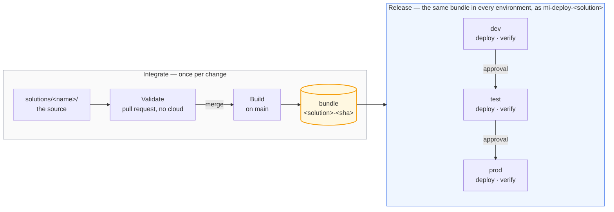

# The path to production

Every change takes the same path: authored on a feature branch, reviewed in a pull
request, merged after approval, built once, and deployed by machinery. This document
shows that path in two views — how work reaches the repository (Microsoft's
*development process*) and how the repository reaches a workspace (its *release
process*).

## The words, once

Every term this repository uses in a special sense, in one place. Most are ordinary
industry words used ordinarily; where one is not, the table says which industry concept it
maps to. Three are also the names of workflows, which is where a reader usually stumbles.

| Term | What it means here | Worth knowing |
|---|---|---|
| **Solution** | One team's product: a folder under `solutions/`, three workspaces, its own deploy identity and reviewers | Adding one is a folder copy; everything else derives from the name |
| **Bundle** | The build artefact, in the ordinary sense: built once from one commit, immutable thereafter. Here it is `<solution>-<sha>.tar.gz` carrying a `release-manifest.json` with its content digest and pinned tool versions | The only thing that moves between environments |
| **Build** | The phase that produces a bundle | `build-and-deploy.yml` does more than the phase it is named after: on every merge it builds *and* deploys to dev |
| **Deploy** | Apply one bundle to one environment | Always the same mechanism, whichever environment |
| **Promote** | Deploy a bundle that has *already* succeeded in dev to the next environment, rebuilding nothing | The difference from deploy is provenance, not mechanism — `promote.yml` refuses a bundle whose dev deploy did not succeed, and refuses anything that is not a build of `main` |

| **Feature workspace** | A developer's own workspace, connected to their own branch. **Microsoft's term**, not one coined here | Distinct from a *branched workspace*, which is the Fabric feature that creates one — unavailable here, because no workspace is Git-connected |
| **Guard** | A pull-request check, in the ordinary CI sense. Eight of them, in `deploy/guards.py` | They exist because Fabric fails quietly: seven of the eight catch a mistake that would otherwise deploy cleanly and go wrong later |
| **Data contract** | The industry term, used in the industry sense: one solution publishes tables another agrees to read. Here it is a OneLake shortcut plus a guard that checks the producer still builds the table | Versioned in the consumer's folder, so a contract disappears with either side of it |
| **Heartbeat** | The scheduled production run: rebuild the marts, test them, open an issue if it fails | Ordinary scheduled-health-check sense; it proves production still works rather than changing it |

**Release** is deliberately absent from that list. Microsoft uses it for the whole promotion
process, and this repository borrows it in that sense only — there is no release stage, no
release artefact and no release branch. The one local use is the bundle's
`release-manifest.json`, which records what a bundle is rather than marking a stage.

## Branching

The repository is trunk-based: one long-lived branch, `main`, and short-lived feature
branches — one per change, each optionally backed by a workspace of your own —
kept for the branch, or carried between branches as you go. Environments are not branches: dev, test and prod
differences resolve from values *inside* the bundle, and promotion moves the same
built bundle behind approval gates, recorded as GitHub Deployments. Branches are for
work in progress; environments are for released bundles. A hotfix takes the same
path, just faster.

## The three workspaces

Each solution has three. **dev proves the bundle, test proves the promotion, prod serves
the users.**

**dev** takes every merge, unattended, minutes after it lands: a real publish, a real
`dbt build`, real tests. Promotion refuses any bundle whose dev deploy was not green, so
dev is both the first environment and the gate. Nobody authors here — unlike the `dev` of
a deployment pipeline, it holds what the last merge produced and nothing else.

**test** takes the same bytes, into a workspace that did not build them. That is the only
way to find out whether the values that differ per environment actually rebind — the
semantic model's endpoint, the shortcut into another solution's gold, the value set, the
connection string. An ID that is hard-coded but right in dev is wrong here and fails
here. It is also the first gate a human stands at.

**prod** is the only workspace with a live schedule and the only one the nightly run
touches. That run operates the commit prod was promoted at, not `main`, so merging cannot
reach production behind the approvals. Rollback is promote pointed at an older build.

| | dev | test | prod |
|---|---|---|---|
| Deployed by | every merge | promote | promote, after test |
| Approval | none | one reviewer | one reviewer |
| Ingestion schedule | off | off | on |
| Nightly run | no | no | yes |

The workspaces themselves are identical — one Terraform module builds all three with the
same capacity, roles and identity — so what a workspace *is* never varies; only what has
happened to the bundle inside it. Three simplifications come with that:

- One capacity for all three: separation is by permission, not compute.
- One viewers group for all three: the team sees test and prod alike.
- The same sample data everywhere: test proves the release, not the volume.

## Where a change starts

Every change ships the same way: as a commit. Two documents cover how one gets written —
[authoring locally](local-authoring.md), which is the default and needs nothing provisioned,
and [authoring in the portal](portal-authoring.md), for the work that wants a running
workspace. The rest of this page is what happens after the commit.

## How a change deploys

A solution holds Fabric items and, when it transforms data, a dbt project. Both move
through the same four phases. The phases are the shape of the pipeline; what happens
inside them differs by what changed.

- **Validate** — checks that need no cloud access: lint, format locks, rules.
- **Build** — produce the deployable artefact, once.
- **Deploy** — apply that artefact to one environment; the identity can write to
  that solution's workspaces and nothing else.
- **Verify** — prove it worked before the bundle is allowed any further.

Promotion re-deploys the *same* bundle to the next environment; nothing is rebuilt
between environments. The scheduled production run follows the same rule: it reads the
record of GitHub Deployments for the commit prod was promoted at and operates *that* tree, so a
merge to `main` cannot reach production by way of the nightly job.

Where solutions meet, the contract is checked in the pull request. A shortcut
into another solution's warehouse names its producer (`SALES_WORKSPACE_ID`) and
the table it reads, and a repository guard asserts that producer still builds
that table. Without it the failure is silent: dbt leaves a renamed model's old
table in place, so the consumer's shortcut keeps resolving and its data simply
stops changing.

Three honest limits of the bundle:

- **Deployment is not atomic.** Items publish, then dbt rebuilds the marts. A dbt failure
  in the middle leaves published definitions over marts that have not caught up; the
  remediation is to fix forward or promote the previous bundle, and the nightly run will
  not repair it on its own.
- **Bundles expire.** They are GitHub Actions artefacts, kept 90 days on a public
  repository, so "roll back to any earlier run" has a horizon. Past it, rebuild at that
  commit: the digest is derived from source alone, so the bundle reproduces byte for byte.
- **The bundle carries definitions, not data.** Sample seeding reads the checkout, and no
  data ever travels between environments.

## What updates the data

A deploy changes what things *are*. It never, by itself, changes what they *contain*:
publishing a definition creates an empty warehouse, a notebook that has not run, a model
with no rows. Data appears when something the bundle defined is executed. Those are two
lifecycles, and conflating them is the usual source of confusion:

| | Definitions | Content |
|---|---|---|
| What changes it | Deploying the bundle | Running something the bundle defined |
| What triggers it | A merge, or a promotion someone approved | A schedule, an event, or a deploy |
| How it reaches an environment | Built once, promoted unchanged | It does not travel — each environment produces its own |
| Where it is declared | `solutions/<name>/` | The same repository. Only the trigger differs |

**The rule that decides where a trigger lives is that it follows the runtime.**

- **Work that runs inside Fabric is scheduled by Fabric.** `nb_ingest_orders` carries a
  `.schedules` file in its own item folder, so its trigger is part of its definition and
  travels in the bundle like everything else. `parameter.yml` decides which environments
  actually run it — here, prod only.
- **Work that runs outside Fabric is scheduled outside it.** dbt cannot run inside Fabric —
  [three documented reasons](tooling.md#what-this-repository-chose) — so GitHub Actions
  triggers it: `prod-schedule.yml` on a nightly cron, and `deploy-env.yml` on every deploy,
  so a release leaves the marts consistent with the models that just shipped.

So "does the trigger live in source code?" is yes either way, and that is the important part.
What differs is *which* source: a Fabric-run trigger is a file inside the item, and travels in
the bundle; an externally-run trigger is a workflow, and travels by being merged. Neither
needs a separate DevOps pipeline — same repository, same pull request, different clock.

One consequence is worth following, because it explains a piece of machinery that otherwise
looks arbitrary. An external scheduler is not the bundle, so it has to be *told* which bundle
production is running: the nightly run reads the record of GitHub Deployments to find the
commit prod was promoted at, and operates that tree. A Fabric-run trigger never needs this,
because it was published alongside the thing it triggers.

**What this repository does not use, and why.** Fabric offers richer orchestration —
[Activator](https://learn.microsoft.com/fabric/real-time-hub/tutorial-orchestrate-jobs-with-job-events)
for event-driven runs, data pipelines for multi-step flows, Airflow for complex DAGs. None is
here because the estate does not need one: a notebook and a dbt project, one nightly run. A
solution with real dependencies between steps would reach for a data pipeline, and it would
deploy in the bundle like any other item.

## What rolls back, and what does not

Promotion makes definitions reversible: point `promote` at an earlier run and the bundle
proven then is deployed again, unchanged. That path has been exercised, and it is the whole
of what this repository can undo.

**It cannot undo data, and nothing here pretends to.** Rolling a definition back to
yesterday does not roll back what ran overnight. In this solution the distinction is
concrete:

| Table | Materialisation | On a bad run |
|---|---|---|
| `stg_*` | `table` — rebuilt from the seeded CSVs every run | Disposable. The next run repairs it |
| `dim_customers` | `table` | Disposable |
| `fct_orders` | `incremental`, `merge` on `order_id` | **Accumulates.** A wrong merge is written into history, and re-running does not remove it |

Only the third row is a recovery problem, and only because incremental models are the point
of incremental models. `--full-refresh` appears in no workflow here, deliberately: there is
no path by which CI can rebuild that table from scratch, so nobody does it by accident.

### The platform mechanisms, and why none are wired up

Fabric has real recovery tooling. This repository documents it rather than automating it,
because a demonstration should not imply a recovery posture it has never rehearsed.

| Store | Mechanism | What to know before relying on it |
|---|---|---|
| Warehouse | [Restore points and restore in-place](https://learn.microsoft.com/fabric/data-warehouse/restore-in-place) | System points are created every eight hours, giving an eight-hour RPO. Restore *overwrites* the warehouse in place, keeps its name, and needs Workspace Admin — which no human holds here |
| Warehouse | [Time travel and clones](https://learn.microsoft.com/fabric/data-warehouse/data-retention) | Bounded by the retention period: 30 calendar days by default, configurable 1–120 |
| Lakehouse | [Delta `RESTORE`](https://learn.microsoft.com/fabric/data-engineering/delta-lake-restore), or time travel to read without changing state | `VACUUM` can make a restore impossible by removing the files a version needs |
| Any item | The recycle bin | Restores with the item ID intact, so references survive — measured here |

**One interaction is worth knowing before you copy the cost model.** Warehouse restore
points are only created while the capacity is Active, and retention is counted in calendar
days *including the time the capacity is paused*. A capacity that is paused for most of the
day therefore ages its restore points at full speed while generating them rarely. Pausing to
save money quietly costs recovery granularity, which is a reasonable trade for a
demonstration and a poor one for production.

## Why this shape, and not another

Every choice above — an API-driven release, a bundle, Terraform for access, dbt
outside Fabric — had alternatives, and each cost something. Those decisions, the
tools available and where this repository departs from Microsoft's guidance are
set out in [the tooling and choices page](tooling.md).
