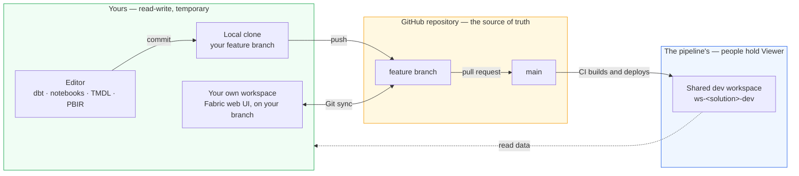
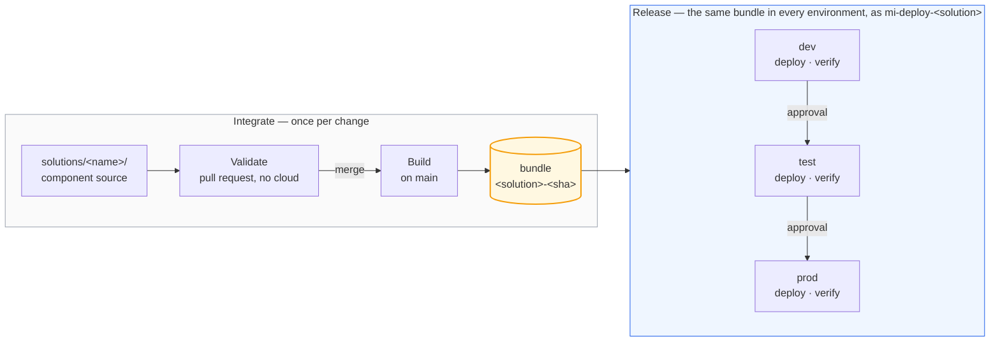

# The path to production

Every change takes the same path: authored on a feature branch, reviewed in a pull
request, merged after approval, built once, and deployed by machinery. This document
shows that path in two views — how work reaches the repository (Microsoft's
*development process*), and how the repository reaches a workspace (its *release
process*).

## Branching

The repository is trunk-based: one long-lived branch, `main`, and short-lived feature
branches — one per change, each optionally backed by a workspace of your own —
kept for the branch, or carried between branches as you go. Environments are not branches: dev, test and prod
differences resolve from values *inside* the bundle, and promotion moves the same
built bundle behind approval gates, recorded as GitHub Deployments. Branches are for
work in progress; environments are for released bundles. A hotfix takes the same
path, just faster.

## The three workspaces

Each solution has three. **dev proves the bundle, test proves the promotion, prod serves
the users.**

**dev** takes every merge, unattended, minutes after it lands: a real publish, a real
`dbt build`, real tests. Promotion refuses any bundle whose dev deploy was not green, so
dev is both the first environment and the gate. Nobody authors here — unlike the `dev` of
a deployment pipeline, it holds what the last merge produced and nothing else.

**test** takes the same bytes, into a workspace that did not build them. That is the only
way to find out whether the values that differ per environment actually rebind — the
semantic model's endpoint, the shortcut into another solution's gold, the value set, the
connection string. An ID that is hard-coded but right in dev is wrong here, and fails
here. It is also the first gate a human stands at.

**prod** is the only workspace with a live schedule, and the only one the nightly run
touches. That run operates the commit prod was promoted at, not `main`, so merging cannot
reach production behind the approvals. Rollback is promote pointed at an older build.

| | dev | test | prod |
|---|---|---|---|
| Deployed by | every merge | promote | promote, after test |
| Approval | none | one reviewer | one reviewer |
| Ingestion schedule | off | off | on |
| Nightly run | no | no | yes |

The workspaces themselves are identical — one Terraform module builds all three with the
same capacity, roles and identity — so what a workspace *is* never varies; only what has
happened to the bundle inside it. Three simplifications come with that:

- One capacity for all three: separation is by permission, not compute.
- One viewers group for all three: the team sees test and prod alike.
- The same sample data everywhere: test proves the release, not the volume.

## Two ways to author, one source of truth

Every change ships the same way: as a commit. There are two ways to author one, and they
are not equally available.

**Locally, in a copy of the repository — the default.** Every item here is a text file:
TMDL for the semantic model, PBIR for the report, Python for the notebook, SQL for dbt.
Edit them with whatever fits — VS Code, an ordinary editor, or Power BI Desktop if you
have Windows and accept that this repository has never exercised the Desktop round trip —
and the change reaches the repository as a commit and a push. Nothing needs to be provisioned for
you, and the whole validation half runs offline: linting, tests, the guards, a dbt parse.

Authoring against real data does not require a workspace of your own either: the team
holds Viewer on `ws-<solution>-dev`, so Power BI Desktop can point at that warehouse's
SQL endpoint while you build a model or report against data the pipeline maintains.

**In the Fabric portal — when your organisation allows it.** All work in Fabric happens in
workspaces, and the shared ones belong to the pipeline: `ws-<solution>-dev` is a deployment
target, so people hold Viewer and cannot edit it, deliberately, so it cannot drift from the
truth. A personal *My workspace*
[cannot connect to Git](https://learn.microsoft.com/fabric/cicd/git-integration/git-integration-process#considerations-and-limitations)
at all. That leaves a temporary workspace of your own, connected to your feature branch —
which requires rights to create workspaces, and
[many organisations will not grant them](portal-authoring.md#before-you-start). Where
they do, the lifecycle is in [authoring in the portal](portal-authoring.md).

Worth naming precisely: Microsoft's
[branched workspace](https://learn.microsoft.com/fabric/cicd/git-integration/branched-workspace)
is a workspace *linked* to a source workspace, created by **Branch out** from a
Git-connected one — the link is what gives you the workspace tree, breadcrumbs and a
Related Branches tab. No workspace here is Git-connected, so that command has nothing to
branch out from. Creating the workspace and connecting it by hand gives the same isolation
and the same round trip, but not the relationship. This repository calls that a **feature
workspace** so the two are not confused.

### What you cannot run locally

Editing is local. Execution is not. Every gate that runs on a pull request here is
deliberately cloud-free — ruff, pytest, the guards and a `dbt parse` need no capacity, no
credentials and no workspace, which is why a fork's pull request is safe to run and
finishes in seconds. The cost is exact: **nothing is executed against Fabric until after
the merge**, when the build deploys to `ws-<solution>-dev`. SQL that parses but does not
run reaches `main` first, and dev is what catches it.

| What needs Fabric | Why | What to do instead |
|---|---|---|
| `dbt build`, `dbt test` | dbt-fabric connects to a live warehouse over TDS. Viewer on the shared dev workspace can read that warehouse but not write to it, and does not grant OneLake read at all, so neither half of the model can run there | Point `DBT_FABRIC_SERVER` and `DBT_FABRIC_DATABASE` at **any empty warehouse you can write to** — dbt builds every object it needs. `deploy/build.py` and `deploy/deploy.py` will set one up in a workspace of your own using the same machinery CI uses |
| `nb_ingest_orders` | `notebookutils` is [only available in the remote runtime](https://learn.microsoft.com/fabric/data-engineering/fabric-runtime-in-vscode), and the paths it reads are OneLake | Usually nothing. dbt reads the seeded CSVs from `Files/` with `OPENROWSET`, not this notebook's Delta tables, so dbt work never depends on running it. When you do need it, the [Fabric Data Engineering VS Code extension](https://learn.microsoft.com/fabric/data-engineering/setup-vs-code-extension) edits and debugs locally while executing on remote Spark |
| Seeing a report render | Power BI Desktop is Windows-only | Edit the PBIR files directly — that is the committed format — and see the render in dev after the merge. There is no Linux-native alternative, and this repository has never tested the Desktop round trip |
| A semantic model against real data | Direct Lake binds to a live SQL endpoint | Desktop can point at dev's SQL endpoint on the Viewer grant while you author; `parameter.yml` rewrites the binding at deploy time |
| `terraform plan` over Fabric resources | The provider refuses to plan against a paused capacity | Resume the capacity first, or leave it — platform changes are applied by CI behind a gate anyway |

The pattern in that table is worth naming, because it is a property of the platform
rather than of this repository: **a Fabric item is a definition, not a program.** Any of
them can be edited anywhere, and none of them can be executed anywhere but a workspace on
a capacity. The alternatives above are all the same trick — keep the editor local and send
the execution somewhere that has compute.

### Which items are worth authoring where

The previous table is about compute. This one is about where a change should *start*, which
is decided by two things: what happens to an item when the portal writes it back, and whether
a tool outside Fabric can open it at all.

Microsoft's rule is the one to begin from — *"if the items you're developing are available in
other tools, you can work on those items directly in the client tool… Items that are only
available in Fabric need to be developed in Fabric"* — and their guidance names exactly two
ways to work in isolation:
[a feature workspace, or client tools](https://learn.microsoft.com/fabric/cicd/git-integration/manage-branches).
It is explicit that the second usually needs no workspace: *"Developers using a client tool…
don't necessarily need a workspace… A workspace is needed only as a testing environment."*
That is this repository's default, and it is worth knowing it is theirs too.

Where this estate departs from their advice is narrow and has one cause. Microsoft names
[Power BI Desktop for semantic models and reports](https://learn.microsoft.com/fabric/cicd/best-practices-cicd)
and VS Code for notebooks. Desktop is Windows-only, so on Linux the report falls back to the
portal and the semantic model falls back to editing TMDL as text.

| Item | Author it | Why |
|---|---|---|
| dbt models | **Locally** | Not a Fabric item. There is no portal representation to edit |
| Warehouse | **Locally**, as dbt models | dbt owns every table in it. Fabric offers two serialisers and they disagree: the definition API refuses it (`getDefinition` answers `OperationNotSupportedForItemType`, measured) while [Git integration serialises it](https://learn.microsoft.com/fabric/data-warehouse/git-integration) as a DacFx database project of `.sql` files (preview). This repository uses neither — the folder holds only `.platform`, so fabric-cicd creates an empty warehouse and dbt fills it. That empty folder is what makes Git integration reject the *whole* directory with `MissingItemDefinitionFiles` |
| `.schedules` | **Locally** | Fabric rewrites the line endings, so a portal commit carries whitespace noise whether or not you touched it. It also cannot hold `parameter.yml`'s placeholder in a feature workspace: Fabric validates the schema and a string where a boolean belongs fails with `InvalidArtifactJobSchedulerException` |
| Report | **Desktop** if you have Windows, else the **portal** for layout | Microsoft's first choice is Power BI Desktop. Without Windows the portal is the only way to see a render, and a portal edit commits back as exactly that edit. Either way, in a feature workspace the visuals cannot bind to data (below), so anything data-driven waits for dev |
| Notebook | **Portal**, when you need to run it | The definition comes back unchanged, and interactive Spark is the one thing no local editor provides |
| Semantic model | **Locally**, as TMDL | Microsoft's first choice is Desktop; without Windows, TMDL in an editor. The portal is not an option regardless — the model cannot load in a feature workspace at all (below), and the export-path trap below applies |
| Variable library | Either | The definition comes back unchanged, and it is a small JSON file, so the editor is usually quicker |
| Lakehouse | Neither | Nothing to author: the definition is a shell and the content is data. A round trip adds an `alm.settings.json` |

**The semantic model is the row to be careful with.** `getDefinition` splits the model's
expression out of `model.tmdl` into a separate `expressions.tmdl` with the authoring
workspace's SQL endpoint baked into it, which silently defeats the `parameter.yml` rewrite
that is supposed to rebind it per environment — green everywhere, pointed at dev forever.
A guard fails the pull request when that happens. Git integration's serialiser does *not*
split the file, so a feature-workspace commit behaves better than an export does. Two
first-party serialisers disagreeing about the same item is reason enough to keep TMDL edits
in an editor, where what you wrote is what gets committed.

**How much of this is measured.** All of it, now. A report was edited in the portal of a
feature workspace and committed back: the diff is exactly the edit — a new page directory
and an updated `pages.json` — and the semantic model was not touched at all, confirming
through a real commit what was previously only inferred from the two serialisers differing.
What Fabric adds on top is uniform and harmless: every file it writes loses its trailing
newline, compact JSON comes back pretty-printed, and `.schedules` line endings are rewritten
(byte-different, identical when parsed). With no edit at all, only `lh_bronze` and
`nb_ingest_orders` report as Modified — the report, semantic model and variable library stay
clean.

One alternative deliberately not taken: running the dbt models against DuckDB or a local
SQL Server for a fast offline loop. The staging models reach OneLake through `OPENROWSET`,
so they would have to be rewritten to a dialect both engines share — trading a gate that
proves the models run in Fabric for a faster one that proves they run somewhere else.

Reads and writes split by construction:

- **Writes go to your feature workspace** — it is yours, and the shared workspaces
  refuse them anyway: team members hold Viewer there.
- **Reads come from the shared dev workspace** — the real, pipeline-maintained data,
  one Viewer grant away.
- **Need dev's data inside your isolated runs?** OneLake shortcuts from your feature
  lakehouse into dev's tables — real input, nothing copied.

### What a Git-connected workspace does to this repository

Tested, rather than assumed — a workspace was connected to a feature branch pointed at
`solutions/sales/fabric`, and the results are worth knowing before you try it.

**Two things stop the sync outright:**

| Symptom | Cause |
|---|---|
| `MissingItemDefinitionFiles` | `wh_analytics.Warehouse` contains only `.platform` — deliberately, so fabric-cicd creates an empty warehouse for dbt to fill. Git integration expects a warehouse to carry a DacFx database project there, and refuses the whole directory rather than just that item. Not a claim that warehouses cannot be serialised: the definition API refuses them, Git integration does not |
| `InvalidArtifactJobSchedulerException` | Hit when `.schedules` held `"enabled": "SCHEDULE_ENABLED"` for `parameter.yml` to rewrite at deploy time. Fabric reads the file directly and requires a boolean. The file now ships a literal `false` and `parameter.yml` rewrites that instead, so this no longer occurs here — the lesson generalises: placeholders survive in free-form files like TMDL and fail wherever Fabric validates a schema |

**The bigger constraint is that a synced workspace is not a deployed one.** Git sync copies
the definitions as committed; it does not run fabric-cicd, so `parameter.yml` never executes
and every placeholder stays a placeholder. `model.tmdl` commits the line
`database = Sql.Database("SALES_WAREHOUSE_ENDPOINT", "SALES_WAREHOUSE_ID")`, and that is
exactly what lands in the workspace — a connection to a server named `SALES_WAREHOUSE_ENDPOINT`.
Measured consequences: the semantic model's editor refuses to open, and opening the report
gives *"Couldn't load the model schema associated with this report."* The report editor still
works, so layout can be changed and committed; nothing data-bound can be.

This is not a defect to fix, it is what parameterisation means — the values are per
environment, and a feature workspace is not one of them. It does decide what the portal is
good for here: **drafting a report's layout, and running a notebook.** Anything that needs to
resolve a connection needs a deployed workspace, which means `ws-<solution>-dev` after a merge.

**And once it does sync, the workspace reports changes you did not make.** With no edit at
all, `lh_bronze` and `nb_ingest_orders` come back *Modified*, and committing produces a
diff of pure whitespace: Fabric writes files with no trailing newline, and rewrites
`.schedules` line endings. Nothing is lost, but every feature workspace starts dirty and
a careless commit fills the repository with noise.

One thing that did **not** happen, despite the API suggesting it would: Git integration
left the semantic model untouched. `getDefinition` splits its expression out into a
separate `expressions.tmdl` with the author's endpoint baked in, but the Git serialiser
does not — the two paths disagree, and only the API path breaks `parameter.yml`. A guard
catches that case either way.

The honest summary: authoring in a feature workspace works for items a workspace can
serialise cleanly, and this repository's solution folder is not one of them today. Treat
the portal as a place to draft, and the repository as where a change becomes real.

## How a component deploys

A solution is made of typed components — Fabric items, a dbt project, a Fabric SQL
database — and every type moves through the same four phases. The phases are the
contract; each type implements them its own way.

- **Validate** — checks that need no cloud access: lint, format locks, rules.
- **Build** — produce the deployable artefact, once.
- **Deploy** — apply that artefact to one environment; the identity can write to
  that solution's workspaces and nothing else.
- **Verify** — prove it worked before the bundle is allowed any further.

Promotion re-deploys the *same* bundle to the next environment; nothing is rebuilt
between environments. The scheduled production run follows the same rule: it reads the
Deployments ledger for the commit prod was promoted at and operates *that* tree, so a
merge to `main` cannot reach production by way of the nightly job.

Where solutions meet, the contract is checked in the pull request. A shortcut
into another solution's warehouse names its producer (`SALES_WORKSPACE_ID`) and
the table it reads, and a repository guard asserts that producer still builds
that table. Without it the failure is silent: dbt leaves a renamed model's old
table in place, so the consumer's shortcut keeps resolving and its data simply
stops changing.

Three honest limits of the bundle:

- **Deployment is not atomic.** Items publish, then dbt rebuilds the marts. A dbt failure
  in the middle leaves published definitions over marts that have not caught up; the
  remediation is to fix forward or promote the previous bundle, and the nightly run will
  not repair it on its own.
- **Bundles expire.** They are GitHub Actions artefacts, kept 90 days on a public
  repository, so "roll back to any earlier run" has a horizon. Past it, rebuild at that
  commit: the digest is derived from source alone, so the bundle reproduces byte for byte.
- **The bundle carries definitions, not data.** Sample seeding reads the checkout, and no
  data ever travels between environments.

## Why this shape, and not another

Every choice above — an API-driven release, a bundle, Terraform for access, dbt
outside Fabric — had alternatives, and each cost something. Those decisions, the
tools available, and where this repository departs from Microsoft's guidance are
set out in [the tooling and choices page](tooling.md).
