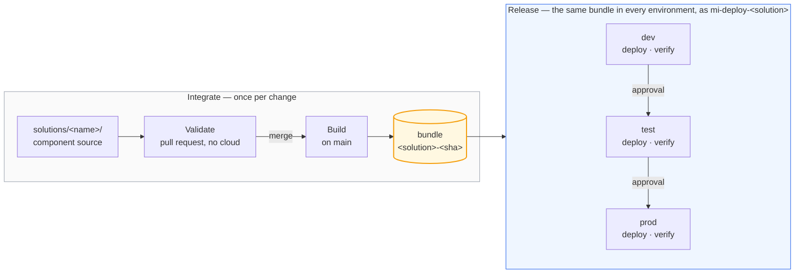

# The path to production

Every change takes the same path: authored on a feature branch, reviewed in a pull
request, merged after approval, built once, and deployed by machinery. This document
shows that path in two views — how work reaches the repository (Microsoft's
*development process*), and how the repository reaches a workspace (its *release
process*).

## Branching

The repository is trunk-based: one long-lived branch, `main`, and short-lived feature
branches — one per change, each optionally backed by a branched workspace that lives
exactly as long as the branch does. Environments are not branches: dev, test and prod
differences resolve from values *inside* the bundle, and promotion moves the same
built bundle behind approval gates, recorded as GitHub Deployments. Branches are for
work in progress; environments are for released bundles. A hotfix takes the same
path, just faster.

## Two ways to author, one source of truth

Every change ships the same way: as a commit. There are two ways to author one:

1. **Edit files in a local copy of the repository**, with the client tool that fits —
   Power BI Desktop for reports, the SQL Database Projects extension for VS Code.
   Edits reach the repository through an ordinary commit and push.
2. **Edit in the Fabric web UI** — which needs a workspace.

In Fabric, all work happens in workspaces, but the shared ones belong to the
pipeline. `ws-<solution>-dev` is a deployment target: CI writes it, people hold
Viewer and cannot edit it — deliberately, so the environment cannot drift from the
truth. And a user's personal *My workspace*
[cannot connect to Git](https://learn.microsoft.com/fabric/cicd/git-integration/git-integration-process#considerations-and-limitations).

Devs can create a
[branched workspace](https://learn.microsoft.com/fabric/cicd/git-integration/branched-workspace) —
a temporary, isolated workspace connected to a feature branch — and portal edits land
in the repository like any other commit. When the pull request merges, the workspace
is deleted. One practical note: because no shared workspace here is Git-connected,
the portal's *branch out* button has nowhere to appear — creating one is instead
create workspace → Workspace settings → Git integration → connect to your branch,
which yields the identical result.

Reads and writes split by construction:

- **Writes go to your branched workspace** — it is yours, and the shared workspaces
  refuse them anyway: team members hold Viewer there.
- **Reads come from the shared dev workspace** — the real, pipeline-maintained data,
  one Viewer grant away.
- **Need dev's data inside your isolated runs?** OneLake shortcuts from your branched
  lakehouse into dev's tables — real input, nothing copied.

## How a component deploys

A solution is made of typed components — Fabric items, a dbt project, a Fabric SQL
database — and every type moves through the same four phases. The phases are the
contract; each type implements them its own way.

- **Validate** — checks that need no cloud access: lint, format locks, rules.
- **Build** — produce the deployable artefact, once.
- **Deploy** — apply that artefact to one environment; the identity can write to
  that solution's workspaces and nothing else.
- **Verify** — prove it worked before the bundle is allowed any further.

Promotion re-deploys the *same* bundle to the next environment; nothing is rebuilt
between environments. The scheduled production run follows the same rule: it reads the
Deployments ledger for the commit prod was promoted at and operates *that* tree, so a
merge to `main` cannot reach production by way of the nightly job.

Where solutions meet, the contract is checked in the pull request. A shortcut
into another solution's warehouse names its producer (`SALES_WORKSPACE_ID`) and
the table it reads, and a repository guard asserts that producer still builds
that table. Without it the failure is silent: dbt leaves a renamed model's old
table in place, so the consumer's shortcut keeps resolving and its data simply
stops changing.

Three honest limits of the bundle:

- **Deployment is not atomic.** Items publish, then dbt rebuilds the marts. A dbt failure
  in the middle leaves published definitions over marts that have not caught up; the
  remediation is to fix forward or promote the previous bundle, and the nightly run will
  not repair it on its own.
- **Bundles expire.** They are GitHub Actions artefacts, kept 90 days on a public
  repository, so "roll back to any earlier run" has a horizon. Past it, rebuild at that
  commit: the digest is derived from source alone, so the bundle reproduces byte for byte.
- **The bundle carries definitions, not data.** Sample seeding reads the checkout, and no
  data ever travels between environments.

## Where this design diverges from Microsoft's guidance

This repository lands on the end state
[Microsoft's CI/CD best-practices guidance](https://learn.microsoft.com/fabric/fundamentals/understand-best-practices-fabric-cicd)
recommends — an API-driven release process with fabric-cicd, Terraform-provisioned
infrastructure, trunk-based branching, service principals throughout, repository
environments as approval gates. Where it deliberately takes a different side of a
decision that guidance frames, the choice and its trade-off are recorded here.

| Microsoft's framing | This repository | Why |
|---|---|---|
| A separate capacity per environment is the recommended practice | One shared F2 across every environment of every solution | Cost: this is a demonstration sized to ~US$0.36/hour. The trade-off is real — no noisy-neighbour isolation between test and prod — and a production estate should split capacities by changing one attribute in the solution module. |
| A separate Terraform configuration per environment, so a dev mistake cannot touch prod | One configuration and state file spanning all environments | Workspaces are cattle here: definitions redeploy from Git and a deleted workspace restores within retention. The blast-radius control is the reviewer-gated apply, not state isolation. An estate where workspaces carry irreplaceable state should split the configuration. |
| The development process anchors on a Git-connected dev workspace (*Update from Git* after each merge, *branch out* from it) | No workspace is Git-connected; dev is a deployment target exactly like test and prod | Every environment is built by the same machinery, so dev cannot drift and what worked in dev is what ships. The cost: developers reach the portal through a self-created branched workspace rather than a one-click *branch out* (note above). |
| Three release options: deployment pipelines, Git synchronization (a workspace per environment, each synced to a branch), API-driven | API-driven; deployment pipelines argued against in the README; Git-sync not chosen | Git-sync makes environments equal to branches, which reintroduces per-environment drift (cherry-picks, hotfixes to branches) that build-once/promote-many exists to prevent. |
| Variable libraries should usually be the first choice for parameterization | `parameter.yml` rewrites do the work; the Variable Library is deployed and its per-environment value set activated, but nothing reads it at runtime | Two limits, both found by testing. Microsoft's own dependency-binding matrix shows semantic-model connections never auto-bind, so a library cannot rebind them — `parameter.yml` is the sanctioned home for those rewrites, enforced by a repository guard. And `notebookutils.variableLibrary` has no service-principal support, so code deployed by this pipeline cannot read a library at all. The library stays as the shape a solution grows into when that support lands. |
| Data refresh via `.schedules` files inside item definitions | A GitHub Actions cron drives ingestion and transformation | The schedule must sequence capacity resume → ingest → dbt → tests and open an issue on failure; an in-item schedule can do none of that, and would fire against a paused capacity. |
| Least privilege for every automated caller | The platform identity keeps a `refs/heads/main` federated credential and runs the nightly schedule | Terraform must be able to plan from `main` before an environment gate exists to approve it, and only an identity with Azure rights can resume the capacity. The blast radius is real and is why `main` takes no direct pushes: reaching that credential means merging a reviewed pull request. |

Terminology, mapped once: what this repository calls a **solution** (a team's product
plus its per-environment workspaces and delivery config) is the guidance's *Fabric
CI/CD project*; **promote** is its *release process*; the **bundle** is this
repository's own extension — a built, immutable snapshot of item definitions, which
the guidance's release options all rebuild from a branch instead.
